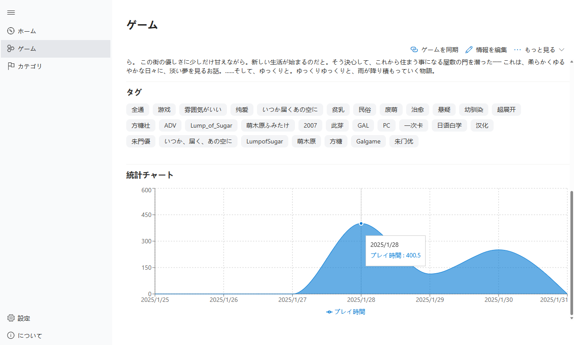
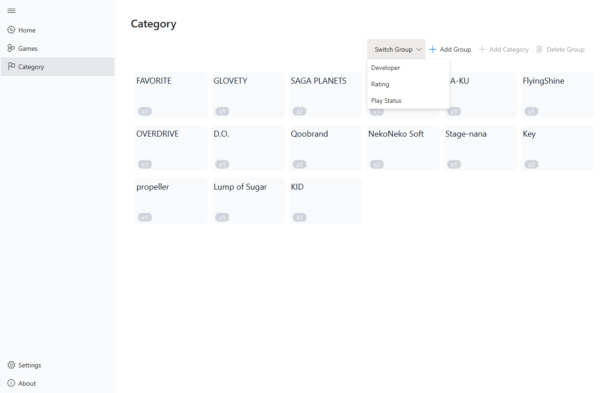
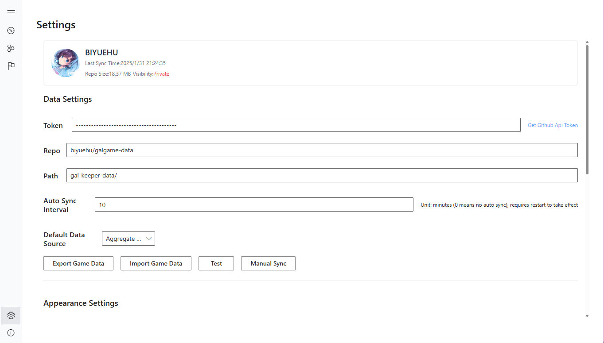

<!-- markdownlint-disable -->

  

   

  

# Nanno | GalKeeper

[English](README.md) | 日本語

**TauriとReactで構築された、プログラマー向けの軽量で高速なビジュアルノベル管理、統計、クラウド同期ツール**

プロジェクト名の「Nanno」は、ビジュアルノベル[**魔女こいにっき**](https://vndb.org/v14062)のメインキャラクター[**南乃 ありす(Nanno Arius)**](https://vndb.org/c18258)に由来しています。

<!-- markdownlint-enable -->

## 多言語対応

- English
- 日本語
- 繁体中文
<!-- - 简体中文 -->

## 使用技術

- React
- FluentUI
- UnoCSS
- Recharts
- @kotori-bot/i18n, @kotori-bot/tools, @kotori-bot/logger
- TauriV1（Electron、NW.js、TauriV2ではなく）
- LevelDB
- Roga

## ライセンス

このプロジェクトは[BCU](https://github.com/ICEAGENB/ban-zhinese-using)ライセンスの下で公開されています。

## スクリーンショット

<!-- markdownlint-disable -->

<!-- markdownlint-enable -->