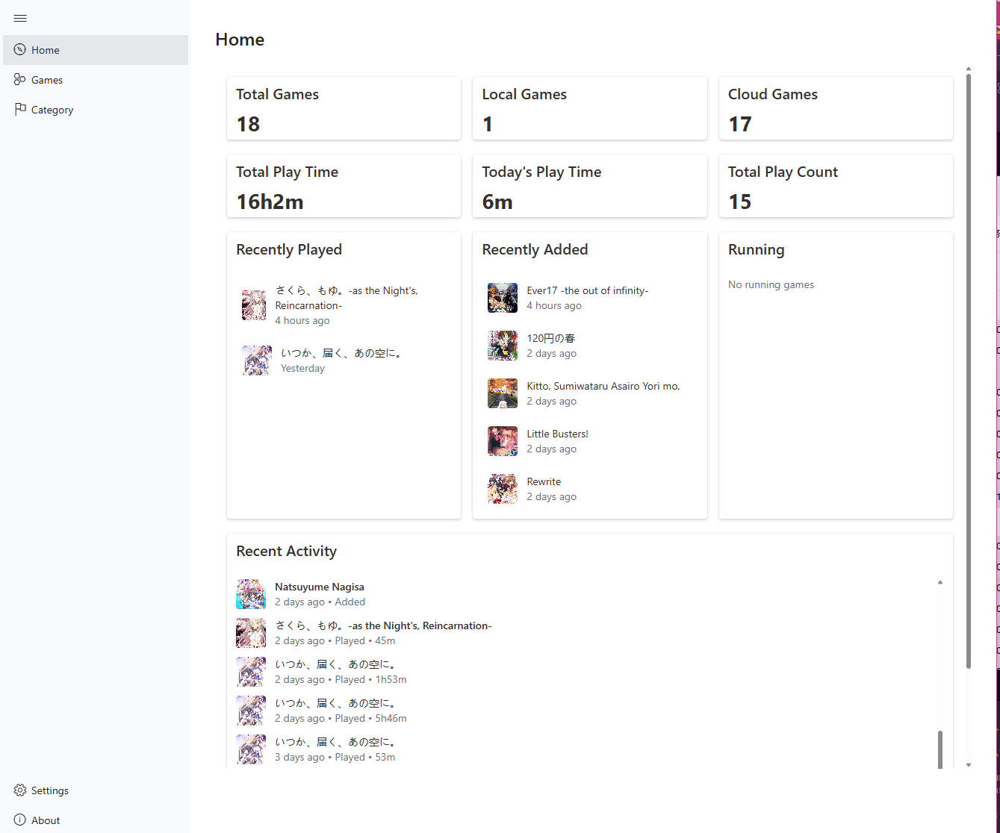
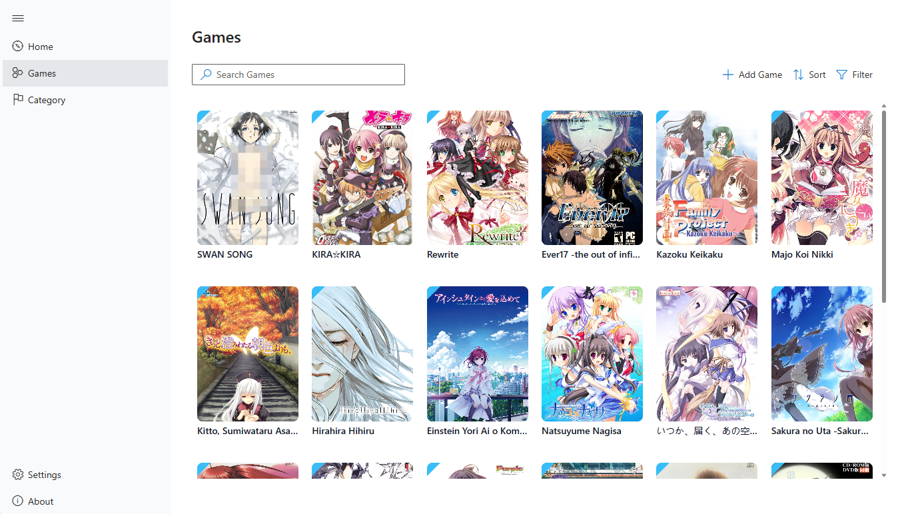
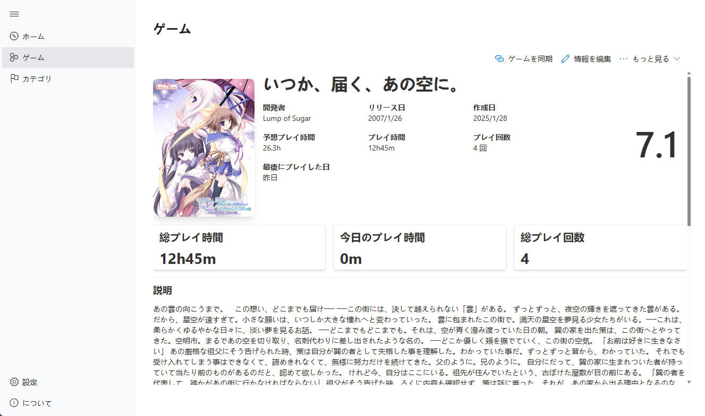

<!-- markdownlint-disable -->

  

   

  

# Nanno | GalKeeper

**A lightweight and fast visual novel management for coders, statistics and cloud syncing tool built with Tauri and React**

<!-- markdownlint-enable -->

## Internationalization

- English
- 日本語
- 繁体中文
- 简体中文

## Stacks

- React
- FluentUI
- UnoCSS
- Recharts
- @kotori-bot/i18n, @kotori-bot/tools, @kotori-bot/logger
- TauriV1 (Fuck Electron, NW.js and TauriV2)
- LevelDB
- Roga

## License

The project is licensed under the [BCU](https://github.com/ICEAGENB/ban-zhinese-using) license.

## Screenshots

<!-- markdownlint-disable -->

<!-- markdownlint-enable -->